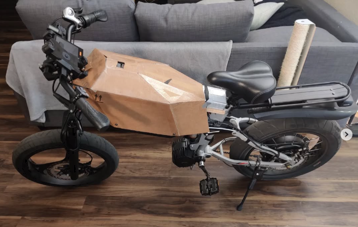
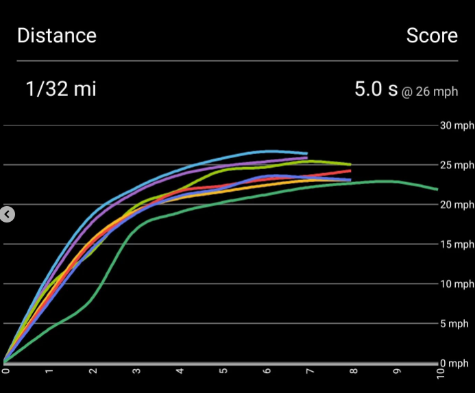
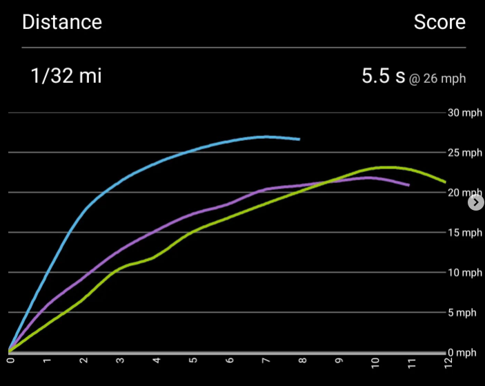
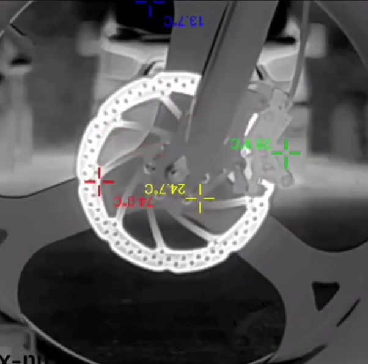
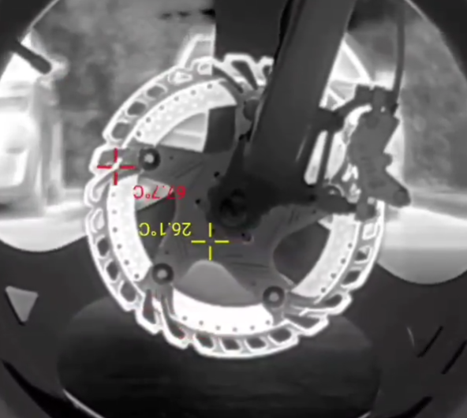

# Dual Battery, Dual Motor EBike.

This project demonstrates building a dual cell chemistry ebike.

## Test youtube video embedding

  <iframe
    frameborder="0"
    title="YouTube video player"
    allowfullscreen
    width="560"
    height="315"
    src="https://www.youtube.com/embed/8kOBL87L7cI?enablejsapi=1&mute=1"></iframe>

The video above shows the dual motor setup.  The Rear 3kW hub motor is powered from a supercapacitor bank. The 1.5kW mid drive motor is powered from a LiFePo battery.

  <iframe
    frameborder="0"
    title="YouTube video player"
    allowfullscreen
    width="560"
    height="315"
    src="https://www.youtube.com/embed/RLlXLqIWGpU?enablejsapi=1&mute=1"></iframe>

The video above is a sped up video showing capacitor cell "balancing".  Quote balancing because capacitors do not need balancing like conventional lithium batteries do.  More about in the design notes below.

## Project Goals

The main objectives of this project were:

* Make a high performance E-Bike and keeping the bike lightweight.
* Explore use of supercapacitors and dual cell chemistry design.

## Specs/Parts List

* < 100lbs
* [2kW hub motor](https://www.ebay.com/itm/396169201236?_skw=2000W+rear+hub+motor+bike&itmmeta=01JK96HB61GJVG4447RGYE3VYT&hash=item5c3d864654:g:MnwAAOSwy4pkcoVv&itmprp=enc%3AAQAJAAABAHoV3kP08IDx%2BKZ9MfhVJKmKmQdI%2FaS%2F8izMhPB2Ym5QkRLuHw2VKyH1f2%2Bf%2BQuFKLOjoctQm%2BtIvpJBz2WnTCehLwYOeBwdrYiRghTP1PH1Pn3zXbR%2F4vbO4T%2B%2FqTh1xB%2F0qi2wEaKodcjTeIVoudi8v6ZD3ZfUAJFWYyGzgdOVylzuUXVaxIY0yYMLNcIcH9cvmW04nc9vJQhHN96nTwF0LFJ9io0U7uLS%2F3Y0MbZ%2FRVQZ7YHPxvhWXJ0x2hgoLxTOvpu3wdNQ2KRgHLbFCIvXRh5iaAqSnhtHNuEQZaNlloopf9kTo5hLnOMNGdFhf9y0fbrGj76WIfHpbgaKFPE%3D%7Ctkp%3ABFBMlLPFpppl)
* 1.5kW mid drive motor reprogrammed [Bafang BBSHD](https://lunacycle.com/bafang-bbshd-1000w-middrive-kit/)
* Adjustable air suspension [Front](https://www.amazon.com/gp/product/B08LRZWZZ1/ref=ppx_yo_dt_b_search_asin_title?ie=UTF8&th=1&psc=1) / [Back](https://www.amazon.com/gp/product/B0BRBTSDFX/ref=ppx_yo_dt_b_search_asin_title?ie=UTF8&th=1&psc=1)
* Hydraulic disk brakes
* 203mm brake rotors
* [Base Bike](https://www.amazon.com/gp/product/B08P1S9ZS1/ref=ppx_yo_dt_b_search_asin_title?ie=UTF8&psc=1)
* [52V 15AH LiFePo battery](https://www.amazon.com/Battery-100W-700W-Electric-Lithium-Ion-Indicator/dp/B0B5GL9TFR/ref=sr_1_17_sspa?crid=24WBSKLCR8DC9&dib=eyJ2IjoiMSJ9.qpsmlwM1z1ufPjwLc9lF6hOaaVTDOxITPdAQ-IrY2t3GjHj071QN20LucGBJIEps.GogyQEVutBf_7ehvwrvagU2ZCJK4qap4iNvzOHigGCc&dib_tag=se&keywords=60v%2Blifepo4%2Bebike&qid=1738697821&sprefix=60v%2Blifepo4%2Bebike%2Caps%2C239&sr=8-17-spons&xpid=_E6RKE6yQ9Q__&sp_csd=d2lkZ2V0TmFtZT1zcF9hdGZfbmV4dA&th=1)
* 6x [Supercap Bank](https://www.ebay.com/itm/395513958486?_skw=supercapacitor&itmmeta=01JK970VG849R9WDZ51SKHNM5M&hash=item5c16781056:g:rXgAAOSw8Mhmh1Vt&itmprp=enc%3AAQAJAAAA0HoV3kP08IDx%2BKZ9MfhVJKl4MYXlm56yu3S47s2sj4aYh0sijHks1NzispO7ZLRDSpYNh5ILh%2BvIINMx5mj0SpDfS5JfrYz9TeqSzev7ZzRIkxqKthCa97vTSbaNa4mIeIsAUWlu4I16OMpUeKKWSXzFjVkAtwciLciZ4RJulVmIhhjeablVSRryUvZBBw453rDQG3dH%2F7ZpQ5YGobtCmnnDN0CZauAEWAIQkYH0WQb1yJqljGUgLxeKqhK9jtcxVjvUtm7ywRy2x0FdlTNHdIQ%3D%7Ctkp%3ABk9SR4S5g6eaZQ)
* DCDC 1500W Buck Converter
* Various other bits to make everything work

## Architecture

Sorry no diagram, its easy to understand and my efforts is not to showcase the work but to explore a dual cell design.

52V LiFePo 14S(4P?) battery feeds power to mid drive motor and a 150W DCDC buck converter. The buck converter is set to 48.8V with a limit of 1kW and feeds power to a 18S2P 48V 1000F Supercapacitor bank. The supercaps power the rear hub motor.

52V LiFePo battery was chosen because I didn't want to enter whats considered high voltage range in a 72V area.  I could have aimed for 2-3S more but they weren't standard sizes for battery configurations.

The supercap bank was configured to be 18S2P, 48.6V peak with max power draw of 50A.

I would have liked to configure the supercaps into a 24S2P configuration but ran into a DCDC converter issue.  Buck and Boost converters are way more expensive than just a Buck or a Boost converter in the 150W range.  The voltage ranges for the LiFePo battery of 42V-58.8V allows for a buck convert to function completely within the range of the superacapcitors 0V-48.6V with slight overlap. The overlap was not any issue because you rarely operate the ebike near empty.

Since I am using two speed controllers a simple voltage follower circuit with output bias adjustment was added to allow one throttle to drive two speed controllers.

Image above shows acceleration in different gears, with both motors activated.  The torque range favors the highest gear with low rpm.  It looks like theres an accel limit in the Bafang controller which I don't have access to modify. I do have a crank that has higher tooth count but doing so will decrease clearance.

The image above shows acceleration times with rear hub motor only (Purple), mid drive only (Green), Both (Blue).  Pedalling has negligible effects on acceleration.

## Notes

* Theres a common misconception in the capacitor community which some manufacturers and resellers fall for.  In school you are taught that if you add two capacitors in series, the total capacitance drops. Most people fall into the trap that this ONLY happens if you keep the voltage constant.  So some manufacturers or resellers will sell banks of capacitors at a lower capacity with a matching price.  Luckily I found one such case and picked up a lot of capacitors banks for cheap.

* Yes I do "overcharge" the supercapacitors but this is intentional.  The cell "balancing" for supercaps are different than batteries.  Supercaps have a rating of 0V-2.7, you can go higher than 2.7 at the cost of faster degredation.  The balancing is only done near the top end so that all the capacitors reach the 2.7V limit.  You usually dont care if the cells are unbalanced in the lower range, you only care about a cell not going under 0V which for this design the rear drive electronics never pull below 28V.  So overcharging is necessary to keep the cells closer balanced.

* During rapid accel and deccel cycles, you can deplete the available power from the supercapacitors, which is noticed by a lack of power.  I can increase the DCDC power conversion but then you start hitting the limits of draw current from the LiFePo battery. 

* Regen is not used due to one major flaw in the design.  You can only regen from the rear hub motor, since regen on the mid drive will cause chain derailment.  The rear hub motor will regen to the supercapacitor bank.  The LiFePo continuously tops off the capacitor bank so you have lots of times where you regen is cut to avoid going over max voltage.  The capacitor balancing can only handle 100mA. Since the bike is meant to be high performance which includes stable hard braking, regen was omitted.

* Fastest acceleration is while in highest gear for mid drive. I think the speed controller is more optimized to have greater torque only in the low rpms.

## Future Design Considerations

* Adding custom rear drive controller to overpower the rear hub motor.  Since rear hub motor is only for burst of power, ample time can be given for the motor to cool off.  This would mean to have temperature feedback in the rear drive controller and a thermal limit algorithm to be designed.

* Add smarts into the DCDC converter, calculating how much energy can be recovered from braking and only adding enough energy to the supercaps to avoid over voltage.  Also would need to add cutout regen for going down long slopes.

## Additional

In the images above you can see the difference between 160mm and 203mm disk brakes.  The 203mm are discontinued and can only be bought without the additional cooling plates.  Braking feel has increased greatly.  The rears are easy to lock up. Provided you are on dry tarmac, the front is adjusted that bottoming out the front hand brakes will not lock the fronts up but can fully bottom out the front suspension travel.

The bike is fun to practice knee dragging while being safe at slow speeds.  It can do wheelies.  Stoppies are difficult because of the rear weight.

