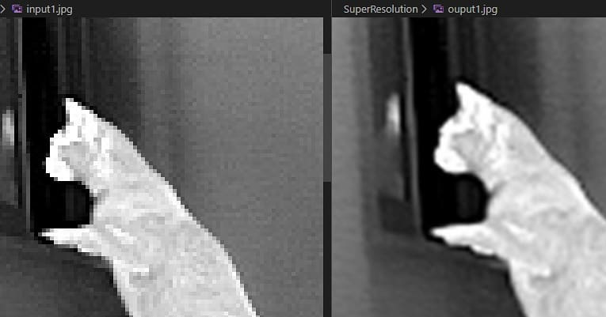

# Senior Project 2016: Real-time Data Analytics Pipeline

This project demonstrates using super resolution with image stacking in real time.

## Thermal Video with no image stacking

  <iframe
    frameborder="0"
    title="YouTube video player"
    allowfullscreen
    width="560"
    height="315"
    src="https://www.youtube.com/embed/8_6H-6UjcI4?enablejsapi=1&mute=1"></iframe>

The video above is a baseline with no image stacking.

  <iframe
    frameborder="0"
    title="YouTube video player"
    allowfullscreen
    width="560"
    height="315"
    src="https://www.youtube.com/embed/NU_S2Dr9wsc?enablejsapi=1&mute=1"></iframe>

The video above shows the video with image stacking in real time.

  <iframe
    frameborder="0"
    title="YouTube video player"
    allowfullscreen
    width="560"
    height="315"
    src="https://www.youtube.com/embed/z4xqAWDtc-M?enablejsapi=1&mute=1"></iframe>

The video above shows pixel peeking comparison of unstacked image with stacked image.  You can see the artifacts of the stacking during quick movements.  The weather was also windy which decreases photostacking accuracy.

## Project Goals

Explore photo stacking in real time with keypoint matching.

The thermal camera image resolution is 384x288.  Stacking the image 5 times yields a resolution "increase" of 960x720.

The image stacking code can be found [here](https://github.com/Bejec/realTimeSuperRes)

## Explanation

Photo stacking is simply taking multiple images, upsampling them all to a higher resolution and averaging out the images together.  This "increases" the resolution by using noise to add data within an image.

If the images are slightly shifted from each other then you need to add in keypoint matching.  This function will identify unique keypoints on two images and shift and bend one of the image to align, then photo stacking can be applied.

The real time aspect of it is not exactly real-time, it is delayed by 1 frame.  I applied the same concepts as a FIR filter or emacs filter which basically aligns the previous image with the current image then photo stacks them and displays them to the user.

## Notes

Thermal cameras have low framerates, so stacking 5 images on a 25Hz framerate will mean that the oldest stacked image is 200ms old.  You can see this when the dog turns his head and you can see a ghosting affect.  This method is not good for fast moving subjects.

This is running on one core, no multithreading Intel Celeron N4100 mobile computer.  Keypoint matching is a very intensive process, lowering amount of keypoints decreases alignment but increases performance.

I did add software logic to cancel alignment if keypoint matching takes longer than 1/25hz (40ms) and just display the latest image. This reduced stuttering greatly, yet you can still observe stuttering in the video.

Whats cool is that you can increase processing which is much cheaper than speccing a higher resolution camera.

Photo stacking may not always increase resolution and has a change to introduce artifacts.

Heres an example of a 19x increase in pixel stacking with many images. Although effective increase is more like 2-3x. Input image is multiple 384x288(left) images, I forget how many I stacked.  Output image is 1920x1080(right)

[Link to Thermal Camera used](https://hti-instrument.com/collections/best-sellers/products/ht-301-mobile-phone-thermal-imager)

## Future Considerations

Multiprocessing can be applied to run keypoint matching on a dedicated core, while the capturing and stacking of the images can be done on the main core.  This can reduce stuttering greatly and can open up more resources for stacking more images to increase resolution.  Multithreading is not ideal as this can cause deadlock which may increase stuttering.

Gyroscope data with SLAM can reduce number of keypoints which can reduce processing.

