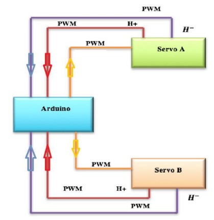
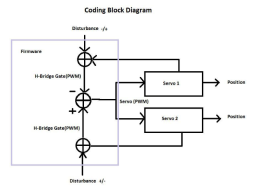

# Senior Project 2016: Bi-directional transmission of torque through software


This project demonstrates a controls system to allow for bi-directional transmission of torque through software.

## Senior Project Display
In the video below I demonstrate the bidirectional control system, by moving both arms and squeezing a cup to demonstrate feeling the squish on an object

<div class="video-container-16by9">
  <iframe
    frameborder="0"
    title="YouTube video player"
    allowfullscreen
    width="560"
    height="315"
    src="https://www.youtube.com/embed/GgMPIi-hsTo?enablejsapi=1&mute=1"></iframe>
</div>


In the video below I show the control hardware.  Multiple arduinos running in parallel.

<div class="video-container-16by9">
  <iframe
    frameborder="0"
    title="YouTube video player"
    allowfullscreen
    width="560"
    height="315"
    src="https://youtube.com/embed/J9OektLJFsI?enablejsapi=1&mute=1"></iframe>
</div>

## Project Goals
Challenge myself enough to meet senior project criteria.

## Architecture



To clarify the block diagram, the user on
servo 1 side provides the disturbance as an input into the
system. While on the mirrored side the disturbance is what
the mirrored arm is interacting with. This provides a
negative disturbance compared to the positive disturbance
the user is introducing. These disturbance values are
compared and the servo is repositioned to bring these
disturbance values to zero. To summarize: the position
output of the servos are electrically linked to the
disturbance being received. This can be viewed as the
servo outputs being mechanically linked.



## Code Example

```
#include <Servo.h>


Servo Servo1, Servo2;  						// create servo object to control a servo
double timer1_close= 0, timer1_open = 0;	//timer1_close is servo counterclockwise torque
double timer2_close= 0, timer2_open = 0;	//timer1_open is servo clockwise torque


//Tuning Variables
int pos= 95;    							//initial servo position
double deadband = 1;						//Deadband value
double voltage1= 200;						//Minimum voltage from H-bridge Gate to be HIGH Vin/1024=voltage1
double voltage2= 200;						//
int uSecDelay = 50;							//timer delay(adjust to de/increase timer value)
int LoopDelay = 5;							//Servo Update Delay(Settling Time)
int	constraintHigh = 149;					//Close Servo Pos #1-140 #2-179 #3-179 #4-179
int constraintLow = 94;						//Open Servo Pos #1-90	#2-1 #3-1 #4-1

void setup() {
//	Serial.begin(9600);					//Debugging Purposes(omit in final Upload)
  	Servo1.attach(9);  						//Sets Pin 9 to Servo object
  	Servo2.attach(10);						//
	Servo1.write(pos);						//initial position
	Servo2.write(pos);
  	delay(2000);		
  	
}

void loop() {
	
//Read All Servo Sensors
if(analogRead(A0)>=voltage1){				//Gives Pulse Width of pin A0
	while(analogRead(A0)>=voltage1){		//Implement a software schmitt trigger?
		timer1_close++;						//(tested Doesnt need one, noise above threshold)
		delayMicroseconds(uSecDelay);
	}
}
if(analogRead(A1)>=voltage2){				//Some servos only need one line to show direction
	while(analogRead(A1)>=voltage2){
		timer1_open++;
		delayMicroseconds(uSecDelay);
	}
}
if(analogRead(A2)>=voltage1){	
	while(analogRead(A2)>=voltage1){	
		timer2_close++;
		delayMicroseconds(uSecDelay);
	}
}
if(analogRead(A3)>=voltage2){		
	while(analogRead(A3)>=voltage2){
		timer2_open++;
		delayMicroseconds(uSecDelay);
	}
}

//Calculate Torque Moment Direction
if((timer1_close-timer2_open)>=deadband){	//See Block Diagram
	pos--;									//++ is close
	pos--;									//Advanced twice to speed up servo response
}											//Remove to increase Servo Resolution
if((timer1_close-timer2_open)<=-deadband){
	pos++;									//-- is open
	pos++;
}
if((timer2_close-timer1_open)>=deadband){
	pos--;
	pos--;
}
if((timer2_close-timer1_open)<=-deadband){
	pos++;
	pos++;
}

//Other things
timer_reset();								//()reset_timers
pos = constrain(pos,constraintLow,constraintHigh);//Constrains Servo values
Servo1.write(pos);							//Writes calc. values to Servos
Servo2.write(pos);
//Serial.println(pos);					//Debug(omit for final upload)
delay(LoopDelay);							//minimize, care for sensor reading while servo is moving	
}

void timer_reset(){							//resets timers...
	timer1_open = 0;
	timer1_close = 0;
	timer2_open = 0;
	timer2_close = 0;
}


```

## Future Design Considerations

If using a similar design, using a comparator
instead of the ADC will speed up processing time incredibly.
As with any design, moving tasks to hardware computing
inherently speeds up timing. The reason this was not used
was due to the complexity of finding a suitable reference
voltage as the measured voltage varies greatly due to
unknown disturbances (ie. temperature, motor noise, etc.)

Adding a low-pass frequency filter will stop
jitter but slow down response time, if one is used, set the
passing frequency around 9kHz to remove most of the
20kHz noise. Although, most mechanical setups as well
as user mass will drown most high frequencies out. Added
the fact that humans have a reaction speed measured in
tens of milliseconds would provide an upper around
10kHz.

The recommended design would be to replace the
individual servo drivers. This would allow more flexibility
in the design. If a substantial number of servos are used, it
may be more cost effective to use an FPGA to create an
ASIC, because performance would be maximized using
hardware rather than software. Another system should be
used to monitor system performance and interact with

parameters. By having this setup, the software can interact
while keeping performance losses to a minimum. An
added bonus would be to implement a recording/playback
function. Where repetitive tasks can be done easier and
faster.
